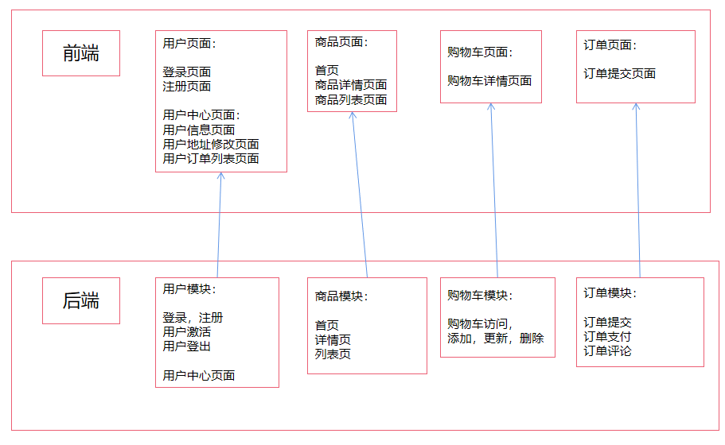
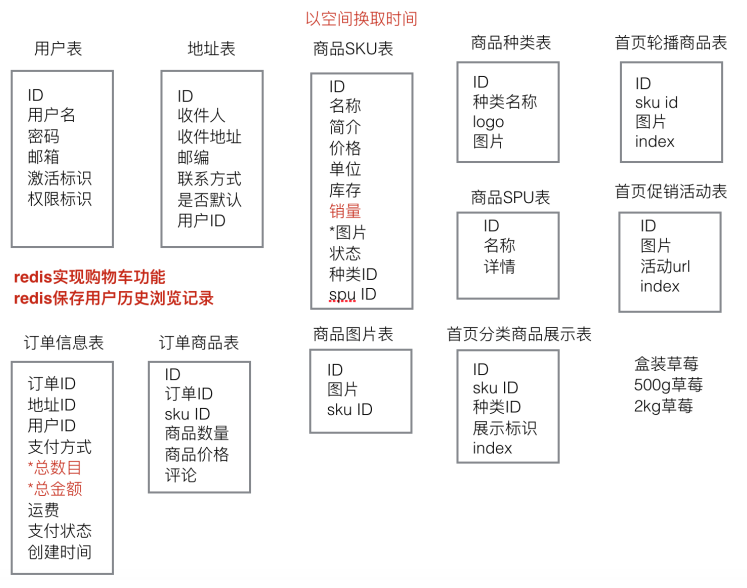
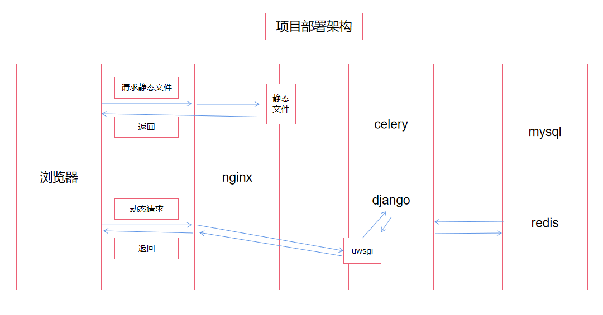

# dailyfresh项目详情
## 技术架构
### 开发架构

### 数据库架构

### 部署架构

## 性能优化
celery + redis 异步发送用户激活邮件

redis存储用户历史浏览记录   数据结构: History_用户id: [skuid1,skuid2,skuid3]
    
使用redis存储用户购物车商品信息 数据结构: cart_userid: {'sku_id1': num, 'sku_id2': num}
    
页面静态化： 首页、商品列表页、商品详情页等用户共同的页面, 把页面静态化，以减少对数据库的操作。当后台数据更改时自动重新生成静态页。
    
页面数据缓存，把页面使用的数据存放在缓存中，当再次使用这些数据时，先从缓存中获取，如获取不到，再去查询数据库，减少数据库的查询次数。
    
处理订单并发时出现的竞争问题

## 其他功能
haystack + whoosh 实现商品搜索功能

使用支付宝接口实现用户支付功能